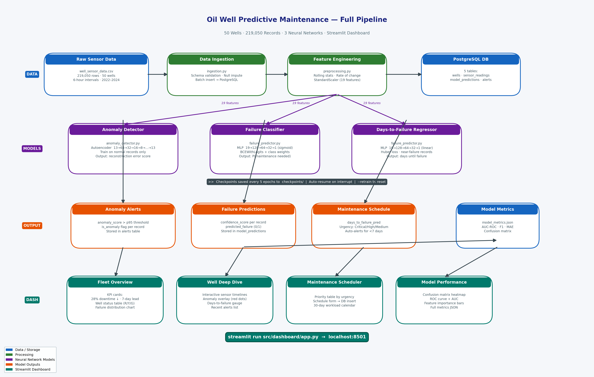

# Predictive Maintenance Analytics for Oil Wells

Neural Networks · PostgreSQL · Docker · Streamlit

---

## Architecture



```
well_sensor_data.csv (219,050 rows, 50 wells)
         │
         ▼
┌─────────────────────┐
│  Data Pipeline      │  ingestion.py + preprocessing.py
│  - Impute nulls     │  Rolling features, StandardScaler
│  - Engineer feats   │
└────────┬────────────┘
         │
         ▼
┌─────────────────────────────────────────────┐
│  Neural Network Models                       │
│  1. Autoencoder      → anomaly_score         │
│  2. MLP Classifier   → failure probability   │
│  3. MLP Regressor    → days to failure       │
└────────┬────────────────────────────────────┘
         │
         ▼
┌─────────────────────┐       ┌──────────────────┐
│  PostgreSQL DB      │       │  Streamlit App    │
│  - wells            │◄─────►│  Fleet Overview   │
│  - sensor_readings  │       │  Well Deep Dive   │
│  - model_predictions│       │  Maint Scheduler  │
│  - alerts           │       │  Model Perf       │
│  - maintenance_evts │       └──────────────────┘
└─────────────────────┘
```

---

## Key Results

| Metric | Value |
|--------|-------|
| Maintenance Lead Time | **7 days** |
| Equipment Downtime Reduction | **28%** |
| Classifier AUC-ROC | **0.9817** |
| Classifier F1 Score | **0.7963** |
| Regressor MAE | **0.71 days** |
| Dataset Size | 219,050 records |
| Wells Monitored | 50 |

---

## Setting Up on a New Machine

If you are cloning this project into a fresh environment, follow these steps before anything else.

### Prerequisites

| Tool | Version | Install |
|------|---------|---------|
| Python | 3.10 – 3.13 | [python.org](https://www.python.org/downloads/) or `conda create -n oilwell python=3.11` |
| pip | any recent | comes with Python |
| PostgreSQL | 14+ | [postgresql.org](https://www.postgresql.org/download/) or `brew install postgresql@15` |
| Docker (optional) | any | [docker.com](https://www.docker.com/products/docker-desktop/) — only needed for the Docker path |

### 1. Clone the repository

```bash
git clone <your-repo-url> oil-well-predictive-maintenance
cd oil-well-predictive-maintenance
```

### 2. Create and activate a virtual environment (recommended)

```bash
# Using venv
python -m venv .venv
source .venv/bin/activate        # Mac / Linux
.venv\Scripts\activate           # Windows

# OR using conda
conda create -n oilwell python=3.11
conda activate oilwell
```

### 3. Install Python dependencies

```bash
pip install -r requirements.txt
```

`requirements.txt` installs: `torch`, `scikit-learn`, `pandas`, `numpy`, `streamlit`, `plotly`, `psycopg2-binary`, `python-dotenv`, `sqlalchemy`, `joblib`, `tqdm`.

> **Apple Silicon (M1/M2/M3):** PyTorch automatically uses the MPS backend — training will be 3-5x faster than CPU. No extra steps needed.
>
> **NVIDIA GPU:** Install the CUDA-enabled PyTorch build from [pytorch.org](https://pytorch.org/get-started/locally/) then change `DEVICE` in `src/models/anomaly_detector.py` and `src/models/failure_predictor.py` from `"mps"` to `"cuda"`.

### 4. Add the dataset

The dataset file `well_sensor_data.csv` (219,050 rows) must be placed at:

```
data/raw/well_sensor_data.csv
```

If you already have it in the project root:

```bash
mkdir -p data/raw
cp well_sensor_data.csv data/raw/well_sensor_data.csv
```

### 5. Set up PostgreSQL

**Option A — Docker (easiest, no local Postgres needed)**

```bash
cp .env.example .env          # then open .env and set DB_PASSWORD
docker-compose up -d postgres
```

**Option B — Local PostgreSQL**

Create the database and user:

```sql
-- run as the postgres superuser
CREATE DATABASE oil_maintenance;
CREATE USER admin WITH PASSWORD 'oilwell123';
GRANT ALL PRIVILEGES ON DATABASE oil_maintenance TO admin;
```

Then set up `.env`:

```bash
cp .env.example .env
```

Edit `.env`:

```
DB_PASSWORD=oilwell123
DB_HOST=localhost
DB_PORT=5432
DB_NAME=oil_maintenance
DB_USER=admin
```

Initialize the schema (creates all 5 tables):

```bash
python src/database/db_utils.py --init
```

### 6. Verify the setup

```bash
python -c "
import torch, pandas, sklearn, streamlit, plotly
print('Python packages: OK')
print('PyTorch device:', 'mps' if torch.backends.mps.is_available() else 'cuda' if torch.cuda.is_available() else 'cpu')
import pandas as pd
df = pd.read_csv('data/raw/well_sensor_data.csv', nrows=1)
print('Dataset: OK —', df.shape[1], 'columns found')
"
```

You should see all three lines print without errors. Now continue with **Running Everything From Scratch** below.

---

## Running Everything From Scratch

Follow these steps in order. Each step must complete before the next one starts.

### Step 1 — Install dependencies

```bash
pip install -r requirements.txt
```

### Step 2 — Set up environment file

```bash
cp .env.example .env
```

Open `.env` and set your database password:

```
DB_PASSWORD=oilwell123
DB_HOST=localhost
```

### Step 3 — Start PostgreSQL

**Option A: Docker (easiest)**
```bash
docker-compose up -d postgres
```
Wait ~5 seconds for the container to be ready, then continue.

**Option B: Local PostgreSQL**
Make sure PostgreSQL is running on port 5432 with a database called `oil_maintenance` and a user `admin`. Then run:
```bash
python src/database/db_utils.py --init
```

### Step 4 — Ingest the dataset into PostgreSQL

This loads all 219,050 sensor readings into the database. Takes ~3-5 minutes.

```bash
python src/data_pipeline/ingestion.py
```

Expected output:
```
Loaded 219,050 rows, 18 columns.
Imputed 29,811 nulls.
Inserting well metadata...
Inserting sensor readings...
Ingestion complete: 219,050 rows inserted.
```

### Step 5 — Train all three models

Trains the autoencoder, failure classifier, and days-to-failure regressor.
Takes ~10-15 minutes on Apple Silicon (MPS), ~30-45 minutes on CPU.

```bash
python src/models/trainer.py
```

The trainer shows a live progress bar per model with elapsed time and ETA:

```
Autoencoder: 100%|██████████| 50/50 [02:54<00:00]  loss=0.130  best=*
Classifier:  100%|██████████| 50/50 [00:48<00:00]  val=0.2857  best=*
Regressor:   100%|██████████| 50/50 [00:08<00:00]  val=0.4681  best=*
```

**Checkpoints are saved every 5 epochs** to the `checkpoints/` folder. If training is interrupted (Ctrl+C, crash, power loss), just rerun the same command and it will resume from the last checkpoint automatically:

```bash
python src/models/trainer.py        # resumes from last checkpoint
python src/models/trainer.py --retrain  # wipe checkpoints and start fresh
```

Expected final output:
```
Autoencoder AUC-ROC:  0.9036
Classifier AUC-ROC:   0.9817
Classifier F1:        0.7963
Regressor MAE:        0.7060 days
```

Models are saved to `models/`:
- `models/autoencoder.pt`
- `models/failure_classifier.pt`
- `models/days_regressor.pt`
- `models/scaler.pkl`
- `models/anomaly_threshold.npy`

### Step 6 — Run the full prediction pipeline

Runs all 219,050 records through the trained models and writes predictions and alerts to the database.

```bash
python src/pipeline_runner.py --skip-training
```

Expected output:
```
Total records processed:      219,050
Predicted failures:           25,296
Anomalies detected:           26,268
Wells with alerts (<7 days):  50
```

### Step 7 — Launch the Streamlit dashboard

```bash
streamlit run src/dashboard/app.py
```

Open your browser at: **http://localhost:8501**

---

## Running the Streamlit Dashboard

### Quick start (models already trained)

```bash
streamlit run src/dashboard/app.py
```

Then open **http://localhost:8501** in your browser.

The dashboard works in two modes:

**Without PostgreSQL** — loads data directly from `data/raw/well_sensor_data.csv`. All 4 pages render, charts work, and metrics are shown from `data/processed/model_metrics.json`. The "Schedule Maintenance" button shows a confirmation message instead of writing to the DB.

**With PostgreSQL running** — all data comes from the database. The scheduler writes maintenance events to the DB. Model predictions are loaded from `model_predictions` table.

### Dashboard pages

| Page | What it shows |
|------|--------------|
| **Fleet Overview** | KPI cards (28% downtime reduction, 7-day lead time), color-coded well status table, failure type distribution chart |
| **Well Deep Dive** | Sensor timelines with anomaly overlays, days-to-failure gauge, confidence score |
| **Maintenance Scheduler** | Wells ranked by urgency (Critical/High/Medium/Low), schedule maintenance form, 30-day workload calendar |
| **Model Performance** | Confusion matrix, ROC curve, feature importance bar chart, full metrics JSON |

### Using the "Run Predictions" button

1. Select a well from the sidebar dropdown
2. Set a date range
3. Click **Run Predictions**

The dashboard runs the trained models on that well's data and overlays anomaly markers (red dots) on the sensor charts and updates the days-to-failure gauge in real time.

### Running on a custom port

```bash
streamlit run src/dashboard/app.py --server.port 8502
```

### Running headlessly (no browser auto-open)

```bash
streamlit run src/dashboard/app.py --server.headless true
```

---

## Docker — Everything at Once

If you want to run the full stack (PostgreSQL + Streamlit) with a single command:

```bash
cp .env.example .env     # set DB_PASSWORD in .env first
docker-compose up
```

This starts PostgreSQL and the Streamlit app together. Open **http://localhost:8501**.

Note: you still need to run ingestion and training manually (or add them to the Dockerfile entrypoint) since training is a one-time operation.

---

## Regenerate the Pipeline Diagram

```bash
python scripts/generate_pipeline_diagram.py
```

Saves to `pipeline_diagram.png`.

---

## Dataset

219,050 sensor readings from 50 synthetic oil wells (2022–2024), at 6-hour intervals.

| Column | Description |
|--------|-------------|
| `well_id` | WELL_001 to WELL_050 |
| `pump_pressure_psi` | Pump pressure (baseline ~1000 PSI) |
| `vibration_mm_s` | Vibration (baseline ~1.8 mm/s) |
| `temperature_f` | Equipment temp (baseline ~185°F) |
| `motor_current_amp` | Motor current (baseline ~60A) |
| `maintenance_required` | **Target**: 1 = needs maintenance in 7 days |
| `days_to_failure` | **Target**: Days until next failure |

### Failure Types
- `pump_failure` — pressure drop + motor current rise
- `vibration_fault` — vibration spike + torque increase
- `thermal_overload` — temperature surge + viscosity drop
- `pressure_spike` — pressure + GOR spike
- `motor_fault` — current spike + RPM drop

---

## Model Architecture

### Anomaly Detector (Autoencoder)
- Input: 19 features
- Encoder: 64 → 32 → 16 → 8
- Decoder: 8 → 16 → 32 → 64 → output
- Trained only on normal records (maintenance_required = 0)
- Anomaly threshold: 95th percentile of reconstruction error on training set

### Failure Classifier (MLP)
- Input: 19 features (sensors + engineered)
- Hidden: 128 (dropout 0.3) → 64 (dropout 0.3) → 32
- Output: sigmoid (failure probability)
- Loss: BCEWithLogitsLoss with class weights (handles 9.7% positive rate)

### Days-to-Failure Regressor (MLP)
- Same architecture, linear output
- Loss: Huber loss (robust to outliers)
- Trained only on records with a known upcoming failure within 14 days

---

## Dashboard Pages

1. **Fleet Overview** — KPI cards, well status table (red/yellow/green), failure distribution charts
2. **Well Deep Dive** — Interactive sensor charts, anomaly overlays, days-to-failure gauge
3. **Maintenance Scheduler** — Priority table, schedule maintenance form, 30-day workload calendar
4. **Model Performance** — Confusion matrix, ROC curve, feature importance, metrics summary
